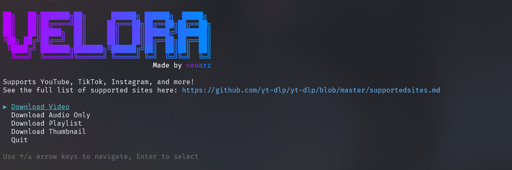

<div align="center"> 

# Velora

**A terminal wrapper for [yt-dlp](https://github.com/yt-dlp/yt-dlp) and [FFmpeg](https://github.com/FFmpeg/FFmpeg)**



</div>

<br>

> [!NOTE]
> **TLDR: Windows Sucks**
> 
> Developing this entire project on Linux and macoOS, I have no intention of giving any support to windows unless someone makes a PR for it. If you are on Windows and would like you use this software, it works on [WSL](https://learn.microsoft.com/en-us/windows/wsl/install) from my testing. (Ubuntu and Arch)

<br>

> [!WARNING]
> **Velora is Still in BETA**
> 
> I've only recently made this project and not everything is perfect. Expect bugs and issues. I really ask you to make a [github issue](https://github.com/neoarz/Velora/issues) if you face any problems, or dm me on discord `neoarz`


## What is Velora?
Velora is a Python-based terminal application that serves as a wrapper for [yt-dlp](https://github.com/yt-dlp/yt-dlp) (video downloader) and [FFmpeg](https://github.com/FFmpeg/FFmpeg) (video and image processor) with an command-line interface. The project uses yt-dlp as its core download engine to download videos and audio from different platforms such as YouTube, Tiktok, SoundCloud, Instagram, and more. It uses FFmpeg for post-processing like video format conversion (MP4, MOV, MKV), audio extraction (MP3), and thumbnail generation (PNG, JPG, WEBP).
 
## Features
- Download from YouTube, Vimeo, SoundCloud, TikTok, Instagram, and more
- Extract audio from videos in MP3 format
- Download entire playlists (Youtube)
- Clean, ui (I tried my best)
- Live download progress with speed and ETA
- Multiple video formats (MP4, MOV, MKV,) using FFmpeg
- Get video information before downloading
- Extract thumbnails from videos
- Choose between custom configs
- Automatic or custom resolution selection

## Installation

#### macOS
```bash
# Install FFmpeg dependency
brew install ffmpeg

# Download latest release from GitHub, unzip, and run
# Go to https://github.com/neoarz/Velora/releases/latest
# Download velora-macos.zip, extract it, then:
chmod +x velora
./velora

```

#### Linux
```bash
# Install FFmpeg dependency
sudo apt install -y ffmpeg             # Ubuntu/Debian
# OR

sudo yum install ffmpeg                # CentOS/RHEL
# OR

sudo pacman -S ffmpeg                  # Arch Linux

# Download latest release from GitHub, unzip, and run
# Go to https://github.com/neoarz/Velora/releases/latest
# Download velora-linux.zip, extract it, then:
chmod +x velora
./velora
```

#### Windows
```bash
# Windows is not currently supported
# Please use WSL (Windows Subsystem for Linux) with the Linux instructions above
# Install WSL: https://learn.microsoft.com/en-us/windows/wsl/install
# Then follow the Linux installation steps in your WSL terminal depending on your distro
```


## Build from Source
If you prefer to build from source or contribute to development:

#### Prerequisites
- Python 3.8 or higher
- pip (Python package installer)

> [!TIP]
> **Don't have Python installed?**
> - **macOS:** Install via [Homebrew](https://brew.sh/): `brew install python` or download from [python.org](https://www.python.org/downloads/)
> - **Linux:** Usually pre-installed. If not: `sudo apt install python3 python3-pip` (Ubuntu/Debian) or equivalent for your distro
> - **Windows (WSL):** Follow Linux instructions above in your WSL terminal

#### macOS Instructions

```bash
# Install FFmpeg and clone repository
brew install ffmpeg

# Clone Repo
git clone https://github.com/neoarz/Velora.git
cd Velora

# Set up virtual environment and install dependencies
python3 -m venv velora_env
source velora_env/bin/activate
pip install -r requirements.txt

# Run the program
python -m Velora
```

#### Linux (Ubuntu/Debian) Instructions

```bash
# Install FFmpeg and clone repository
sudo apt update && sudo apt install -y ffmpeg python3-venv python3-pip

# Clone Repo
git clone https://github.com/neoarz/Velora.git
cd Velora

# Set up virtual environment and install dependencies
python3 -m venv velora_env
source velora_env/bin/activate
pip install -r requirements.txt

# Run the program
python -m Velora
```

> **Note:** For other Linux distributions, replace `apt` with your package manager (`yum`, `pacman`, `zypper`)

#### Windows Instructions

```bash
# Windows is not currently supported for building from source
# Please install WSL (Windows Subsystem for Linux) first:
# https://learn.microsoft.com/en-us/windows/wsl/install
# After installing WSL, open your WSL terminal and follow the Linux instructions above
```


## Contributing

We welcome contributions! Here's how you can help:

1. Fork the repository
2. Create a feature branch: `git checkout -b feature/amazing-feature`
3. Commit your changes: `git commit -m 'Add amazing feature'`
4. Push to the branch: `git push origin feature/amazing-feature`
5. Open a Pull Request

## License

This project is licensed under the AGPL-3.0 License - see the [LICENSE](LICENSE) file for details.

## Support

If you find Velora useful, please consider:
- Starring this repository
- Reporting bugs in [Issues](https://github.com/neoarz/Velora/issues)
- Suggesting features in [Discussions](https://github.com/neoarz/Velora/discussions)
